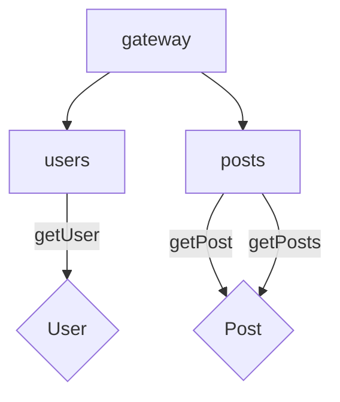

### Test 1

1. Comprendre la structure de l'application et décrire ses principales fonctions et composants utilisés tout en développant leurs caractéristiques (particularités, avantages, etc...).

>>>
L'application est un backend permetant de manipuler les entités user et post. Voici les principaux composants:
NodeJS : Est un gestionnaire de 'packages' javascript leger et performant
NestJS : Est un framework de backend inspiré d'Angular. C'est un framework modulaire, performant et facile d'utilisation.
GraphQL : GraphQL est un langage de requêtes et un environnement d'exécution. Inscrit dans le modèle Client-Serveur, il propose une alternative aux API REST (wikipedia). GraphQL est particulierement appricié pour sa capacité d'offrir au clients la possibilité de determiner le schema du 'payload' et garantit ainsi de meilleures performances (par rapport à une architecture REST)

L'application profite de la prise en charge de GraphQL par NestJS de façon native et inclue des librairies comme (@apollo/federation" et "@apollo/gateway") permettant de sinder l'application en micro-servies :
  gateway
  --> users
  --> posts
>>>

2. Créer un rapide diagramme décrivant l'architecture de la gateway à l'aide de [Mermaid Live Editor](https://mermaid-js.github.io/mermaid-live-editor/#/edit/eyJjb2RlIjoiZ3JhcGggVERcbiAgQVtDaHJpc3RtYXNdIC0tPnxHZXQgbW9uZXl8IEN7TGV0IG1lIHRoaW5rfVxuICBDIC0tPnxPbmV8IERbTGFwdG9wXVxuICBDIC0tPnxUd298IEVbaVBob25lXVxuICBDIC0tPnxUaHJlZXwgRltDYXJdXG5cdFx0IiwibWVybWFpZCI6eyJ0aGVtZSI6ImRlZmF1bHQifSwidXBkYXRlRWRpdG9yIjpmYWxzZX0).

Merci, vous pouvez maintenant sauvegarder vos réponses et basculer sur la branche `test-2`
